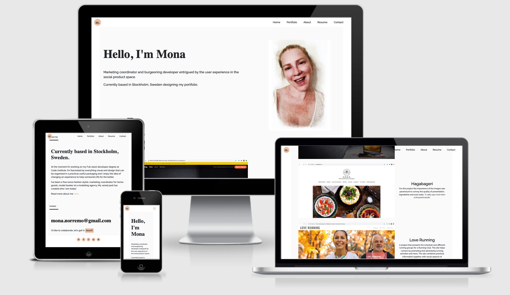

# Personal Portfolio of Mona Norremo

 
My Personal Portfolio is a Milestone Project created for the "User Centric Front-end Development" module of my FullStack Software Development Course offered by Code Institute.

## UX

This Resume portfolio is an online web application designed for users with interest in getting to know who I am. The user can:
* Look at my resume
* See my creativity
* Contact me 
* Hear a little of who I am
* I can present myself in best light and get hired 

The site is for recruiters to consider me as an applicant and hire me. 

## Demo

View the site here: [GitHub](https://monanorremo.github.io/ms1/)

## Features

As the user first comes on the site they will get a warm Hello. The recruiter will smile back at the screen where they are greeted by my profile picture. 
The page is set up as one page where you scroll down to different segments. Or if you choose you can jump to a section by clicking on the sticky-top navbar. 
In the profile section 3 different projects are presented with links and short presentation. In the about section is a brief presentation of myself and a link to my resume. 
In the contact is a very visible email which conveniently opens a new email when clicked on. If you cannot send an email you can easily send a message in contact form. In the footer I invite the recruiter to join me in my social media presence. 

A feature that will be implemented in the future, is a link in the about section which leads to a page with my qualifications and skills listed. As well as some more personal interests and experiences.  

## Wireframe

View the wireframe here: 

## Technologies Used

 
 

 

2. 
 - [Chrome Developer Tools](https://developers.google.com/web/tools/chrome-devtools) - is a set of web developer tools built directly into the Google Chrome browser.
3. 
 - [CSS3](https://developer.mozilla.org/en-US/docs/Web/CSS/CSS3) - Used as the base for cascading styles.

10. 
 - [GitHub](https://github.com/) - is a Web-based hosting service for version control using Git.

13. 
 - [HTML5](https://developer.mozilla.org/en-US/docs/Web/Guide/HTML/HTML5) - used as the base for markup text.

 
#### Libraries
 
- [Bootstrap 4](https://getbootstrap.com/) - is a framework for building responsive, mobile-first websites.
- [Icofont](https://icofont.com/) - is an icon font application that contains 2100+ icons in a single font.
- [jQuery](https://jquery.com/download/) - is a lightweight, "write less, do more", JavaScript library. The purpose of jQuery is to make it much easier to use JavaScript on your website.
- [Slick](https://kenwheeler.github.io/slick/) - is a responsive carousel jQuery plugin that supports multiple breakpoints, CSS3 transitions, touch events/swiping & much more!
- [Bootsrap Select](https://developer.snapappointments.com/bootstrap-select/) - is a jQuery plugin that brings select elements into the 21st century with intuitive multiselection, searching, and much more.
 
Use this section to provide insight into your UX process, focusing on who this website is for, what it is that they want to achieve and how your project is the best way to help them achieve these things.

In particular, as part of this section we recommend that you provide a list of User Stories, with the following general structure:
- As a user type, I want to perform an action, so that I can achieve a goal.

This section is also where you would share links to any wireframes, mockups, diagrams etc. that you created as part of the design process. These files should themselves either be included as a pdf file in the project itself (in an separate directory), or just hosted elsewhere online and can be in any format that is viewable inside the browser.

## Features

In this section, you should go over the different parts of your project, and describe each in a sentence or so.

### Existing Features
- Feature 1 - allows users X to achieve Y, by having them fill out Z
- ...

For some/all of your features, you may choose to reference the specific project files that implement them, although this is entirely optional.

In addition, you may also use this section to discuss plans for additional features to be implemented in the future:

### Features Left to Implement
- Another feature idea

## Technologies Used

In this section, you should mention all of the languages, frameworks, libraries, and any other tools that you have used to construct this project. For each, provide its name, a link to its official site and a short sentence of why it was used.

- [JQuery](https://jquery.com)
    - The project uses **JQuery** to simplify DOM manipulation.

## Testing

In this section, you need to convince the assessor that you have conducted enough testing to legitimately believe that the site works well. Essentially, in this part you will want to go over all of your user stories from the UX section and ensure that they all work as intended, with the project providing an easy and straightforward way for the users to achieve their goals.

Whenever it is feasible, prefer to automate your tests, and if you've done so, provide a brief explanation of your approach, link to the test file(s) and explain how to run them.

For any scenarios that have not been automated, test the user stories manually and provide as much detail as is relevant. A particularly useful form for describing your testing process is via scenarios, such as:

1. Contact form:
    1. Go to the "Contact Us" page
    2. Try to submit the empty form and verify that an error message about the required fields appears
    3. Try to submit the form with an invalid email address and verify that a relevant error message appears
    4. Try to submit the form with all inputs valid and verify that a success message appears.

In addition, you should mention in this section how your project looks and works on different browsers and screen sizes.

You should also mention in this section any interesting bugs or problems you discovered during your testing, even if you haven't addressed them yet.

If this section grows too long, you may want to split it off into a separate file and link to it from here.

## Deployment

This section should describe the process you went through to deploy the project to a hosting platform (e.g. GitHub Pages or Heroku).

In particular, you should provide all details of the differences between the deployed version and the development version, if any, including:
- Different values for environment variables (Heroku Config Vars)?
- Different configuration files?
- Separate git branch?

In addition, if it is not obvious, you should also describe how to run your code locally.

## Credits

### Content
- The text for section Y was copied from the [Wikipedia article Z](https://en.wikipedia.org/wiki/Z)

### Media
- The photos used in this site were obtained from ...

### Acknowledgements

- I received inspiration for this project from X
