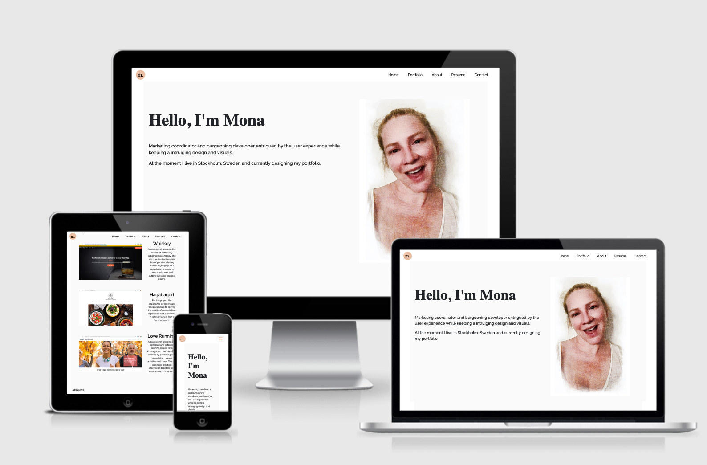

# Personal Portfolio of Mona Norremo

 
My Personal Portfolio is a Milestone Project created for the "User Centric Front-end Development" module of my FullStack Software Development Course offered by Code Institute.

## UX

This Resume portfolio is an online web application designed for users with interest in getting to know who I am. The user can:
* Look at my resume
* See my creativity
* Contact me 
* Hear a little of who I am
* I can present myself in best light and get hired 

The site is for recruiters to consider me as an applicant and hire me. 

## Demo

View the site here: [GitHub](https://monanorremo.github.io/ms1/)

## Features

The page is fully responsive to all screen-sizes.
As the user first comes on the site they will get a warm Hello. The recruiter will smile back at the screen where they are greeted by my profile picture. 
The page is set up as one page where you scroll down to different segments. Or if you choose you can jump to a section by clicking on the sticky-top navbar. 
In the profile section 3 different projects are presented with links and short presentation. In the about section is a brief presentation of myself and a link to my resume. 
In the contact is a very visible email which conveniently opens a new email when clicked on. If you cannot send an email you can easily send a message in contact form. In the footer I invite the recruiter to join me in my social media presence. 

A feature that will be implemented in the future, is a link in the about section which leads to a page with my qualifications and skills listed. As well as some more personal interests and experiences.  

## Wireframe

View the wireframe here: 

## Technologies Used

1. [HTML5](https://developer.mozilla.org/en-US/docs/Web/Guide/HTML/HTML5) - used as the base for markup text.
2. [CSS3](https://developer.mozilla.org/en-US/docs/Web/CSS/CSS3) - used as the base for cascading styles.
3. [GitHub](https://github.com/) - is a Web-based hosting service for version control using Git.
4. [Chrome Developer Tools](https://developers.google.com/web/tools/chrome-devtools) - is a set of web developer tools built directly into the Google Chrome browser.
5. [FontAwesome](https://fontawesome.com/) - used for various icons in the navbar ,modal and footer. 
6. [Google Fonts](https://fonts.google.com/) - used for the 2 fonts used: Playfair and Raleway. 
7. [Bootstrap 4](https://getbootstrap.com/) - is a framework for building responsive, mobile-first websites.

## Testing

The site has been tested manually throughout the process of building the webpage. I have gone to great length to ensure that all the aspects of the site works in all screen sizes and also vertically and horizontally. The site reacts correctly in different browsers such as Chrome, Firefox, Safari, Internet Explorer. 

Online validators used and approved for HTML and CSS: 

## Deployment

I managed the deployment through Github Pages, which updates after new commits are made. Github Pages is directly linked with the master branch and updates seamlessly with new changes and commits made. When I first created my repository I went to the settings page in Github, there there is a section for Github pages. In this section I set up my Github page for this repository adding the master branch as source. 
For a local run, I would clone this repo in the terminal [git clone](https://github.com/monanorremo/ms1.git) and use commands git commit and git push to get updated version of my site. 
          
## Credits

#### Content
All content is original content and in my own words. 

#### Media
Images are borrowed for the portfolio, Whiskey and Love Running are Code Institute projects. Hagabageri is borrowed from the bakery's website, [Hagabageri](http://www.hagabageri.se/)

#### Acknoledgements
The layout of my resume webpage is inspired by several different sites because of the popularity of this layout at the moment. One in particular has inspired with the modified photo in the header and layout of the different sections. [Daniel Autry](https://danielautry.com/) 
The layout has inspired but the code has been unique in the sense that it has not been copied from other resume sites, rather I have used elements from various projects and lessons from Code Institue. When I have needed guidance I have referred to W3C, Bootstrap, Youtube tutorials. 
The modal form is borrowed from [mdbootsrap](https://mdbootstrap.com/docs/jquery/modals/forms/) and modified to suit the layout of my webpage. 

I received inspiration for this project from Code Institute - Project Ideas in the Student Assessment Handbook.
